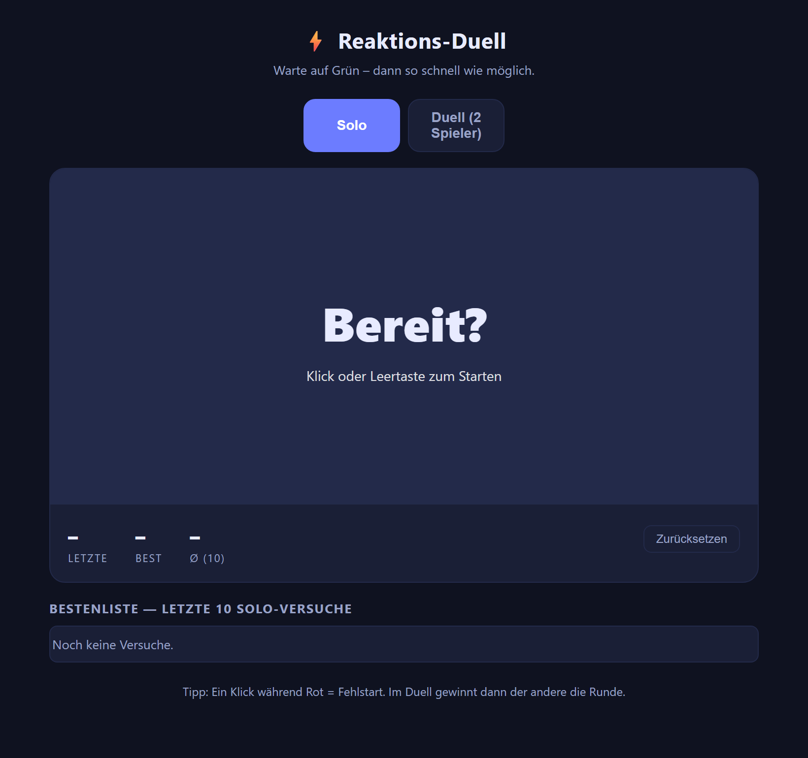

# Reaktions-Duell

Ein kleines Reaktionszeit-Spiel (Solo & Duell) in einer einzigen HTML-Datei.



## Starten

Es gibt keinen Build-Schritt und keine Abhängigkeiten – reines HTML/CSS/JS.

**Schnellster Weg:** `index.html` doppelklicken bzw. per Drag & Drop in den Browser ziehen.

**Alternativ per lokalem Server** (nötig, falls der Browser `file://` einschränkt):

```bash
# Python 3
python -m http.server 8000

# oder Node
npx serve .
```

Danach im Browser `http://localhost:8000` öffnen.

## Spielen

- **Solo:** Klick oder Leertaste zum Starten. Auf Grün warten, dann so schnell wie möglich klicken/Leertaste. Klick auf Rot = Fehlstart.
- **Duell (2 Spieler):** Linke Hälfte = Taste `A`, rechte Hälfte = Taste `L` (oder direkt auf die jeweilige Bildschirmhälfte tippen). Wer zuerst auf Grün reagiert, gewinnt die Runde; ein Fehlstart schenkt dem Gegner den Punkt.

Ergebnisse der letzten 10 Solo-Versuche werden lokal im Browser (`localStorage`) gespeichert.

## Lizenz

[MIT](LICENSE)
